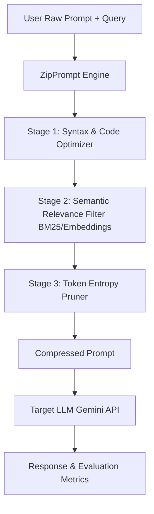

# Hackathon Planning & Evaluation

**Hackathon:** InnovaHack Chapter-1
**Date:** August 1, 2026 – August 2, 2026
**Team Name:** Team Enough

---

## Hour 2: Problem Statement Selection & Brainstorming

### Selected Problem Statement
**Problem Statement 2: Ultra-Low Resource LLM Context Compression Engine**
*   **Project Name:** `ZipPrompt` (or `SqueezePrompt`)
*   **Core Goal:** Build an algorithmic token pre-processor that strips semantic redundancy from prompts, compressing context by 70%+ while retaining 95%+ downstream accuracy.

---

### Project Concept & Architecture: "ZipPrompt"

To build a winning project, we will combine a high-performance backend algorithm with a gorgeous, interactive developer dashboard.

#### 1. The Compression Pipeline (Backend - Python/FastAPI)
We will build a multi-stage pipeline to compress prompts:
*   **Stage 1: Structural & Syntactic Cleaner**
    *   Removes comments, docstrings, blank lines, and redundant white space (for code contexts).
    *   Removes HTML tags, repetitive headers, and boilerplate syntax.
*   **Stage 2: Semantic Importance Filter (BM25 / Embeddings)**
    *   Splits the context into logical chunks (paragraphs or lines).
    *   Scores each chunk's relevance to the user's query using TF-IDF / BM25 or lightweight embeddings.
    *   Discards the bottom $X\%$ of low-relevance chunks.
*   **Stage 3: Token Entropy / Perplexity Pruning**
    *   Uses a lightweight local tokenizer to identify and strip high-probability/redundant connector words (e.g. stop words, repeated prepositions) that do not carry semantic weight.

#### 2. The Developer Dashboard (Frontend - HTML/CSS/Vanilla JS or React)
A premium dark-themed dashboard showing:
*   **Split View:** Original Prompt vs. Compressed Prompt with visual diffs (highlighting deleted tokens in red).
*   **Performance Metrics:**
    *   Compression Ratio (Target: >70%)
    *   Token Count comparison (e.g., 10k to 2.5k tokens)
    *   API Cost Savings calculator
    *   Inference Latency Speedup estimation
*   **Live Evaluation Sandbox:** A panel where users can run queries on both prompts side-by-side, verify answers, and compute similarity/retention metrics.

---

## Hour 2 Commit Verification

*   **Action:** Update project plan with selected problem statement details.
*   **Selected Stack:** Python (FastAPI, NLTK/Tiktoken) for backend + HTML/CSS/JS for frontend dashboard.
